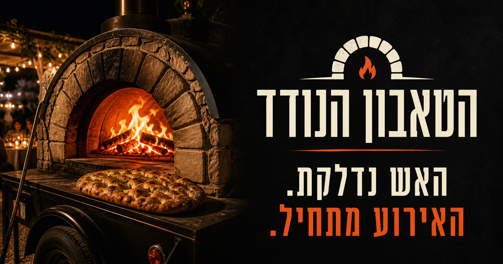

# הטאבון הנודד — אתר מותג אינטראקטיבי

אתר תדמית וחוויית הזמנה בעברית עבור **הטאבון הנודד** — טאבון נייד לאירועים, עם אפייה חיה מול האורחים.

[צפייה באתר החי](https://hatabun-hanoded.jbt.chatgpt.site)



## מה יש באתר

- הירו אינטראקטיבי עם טקס הדלקה, אנימציית Lottie וגיצים חיים.
- תצוגת טאבון ממורכזת שנחתכת רספונסיבית לפי גודל המסך.
- מסע בן שלושה שלבים: מגיעים, מדליקים ומגישים.
- קומפוזר תפריט חלבי/בשרי עם בחירת תוספות ושליחה ל־WhatsApp.
- קטגוריות אירועים וגלריות לפי בית, טבע ואולם.
- שאלות נפוצות, פרטי קשר וקריאות לפעולה מותאמות מובייל.
- תמיכה מלאה ב־RTL, ניווט מקלדת, `prefers-reduced-motion` ו־Save Data.

## טכנולוגיות

- React 19 + TypeScript
- [Vinext](https://github.com/cloudflare/vinext) ו־Vite
- CSS רספונסיבי ללא ספריית UI
- Canvas 2D למערכת הגיצים
- WebGL 2 לאפקט החום בדסקטופ
- Lottie לאנימציית ההדלקה
- OpenAI Sites / Cloudflare Worker לפריסה

## דרישות

- Node.js `>=22.13.0`
- npm

## הרצה מקומית

```bash
npm install
npm run dev
```

לאחר ההפעלה, פותחים את הכתובת שמודפסת בטרמינל.

## פקודות שימושיות

```bash
npm run dev      # סביבת פיתוח
npm run build    # בניית production
npm test         # build + בדיקות חוזה ורינדור
npm run lint     # בדיקות ESLint
npm run start    # הפעלת build קיים
```

## מבנה הפרויקט

```text
app/
├── page.tsx          # התוכן, המצבים והאינטראקציות הראשיות
├── globals.css       # מערכת העיצוב והרספונסיביות
├── EmberField.tsx    # גיצים וחלקיקי אש ב־Canvas
├── HeatHaze.tsx      # עיוות חום ב־WebGL
├── LottieFlame.tsx   # אנימציית ההדלקה
└── layout.tsx        # מטא־דאטה, שפה וכיוון כתיבה

public/
├── brand/            # לוגואים, חותמות ואייקוני המותג
├── campaign/         # תמונות הירו, תפריט, אירועים ופינאלה
├── flame-ignition.json
├── fire-story-filmstrip.webp
└── og.png            # תמונת שיתוף לרשתות

tests/
├── motion-contract.test.mjs
└── rendered-html.test.mjs

.openai/hosting.json  # הגדרת פרויקט Sites
```

## נכסים ומדיה

כל נכסי המותג שנדרשים להרצת האתר נשמרים בתוך `public/` ונכללים בפרויקט:

- לוגואים וחותמות: `public/brand/`
- צילומי קמפיין ומנות: `public/campaign/`
- אנימציית להבה: `public/flame-ignition.json`
- תמונת שיתוף: `public/og.png`

האתר משתמש ב־WebP מותאם לרשת. קבצי המקור הגדולים אינם נדרשים להרצה ואינם אמורים להיכנס למאגר.

## מערכת התנועה והאש

מערכת הגיצים עובדת דרך Canvas יחיד וקבוע. היא:

- מגיבה להדלקה, למעברי מסע ולבחירת תפריט.
- מפחיתה עומס במובייל ומגבילה את מספר החלקיקים.
- נעצרת כשהטאב אינו גלוי.
- מכבדת `prefers-reduced-motion` ו־Save Data.
- משתמשת בגיצים חדים עם מעט blur כדי לשמור על ביצועים.

אפקט החום של ההירו מופעל רק בדסקטופ ובמכשירים מתאימים.

## מצב רספונסיבי והמשך מומלץ

הדסקטופ הוא החוויה הבשלה ביותר. קיימת גרסת מובייל מלאה, אך מומלץ לבצע מעבר mobile-first ייעודי במקום להמשיך לצמצם את פריסת הדסקטופ.

סדר העבודה המומלץ:

1. לקצר את ההירו כך שהצילום, המסר וה־CTA הראשי ייכנסו לכ־85svh.
2. להפוך את מסע שלושת השלבים ל־stepper אנכי פשוט במקום שילוב של sticky וגלילה אופקית.
3. לקצר את קומפוזר התפריט: תמונה בגובה מוגבל, בחירות מייד אחריה ו־CTA קבוע בתוך הזרימה.
4. לבטל מיקומים מוחלטים בטקסט של הפינאלה ולבנות אותו כצילום ולאחריו כרטיס תוכן.
5. להוסיף התאמות נפרדות ל־360px, ל־390–430px ול־mobile landscape.
6. לבדוק לפחות ב־iPhone SE, iPhone 14/15, Pixel וב־Android Chrome עם סרגלי דפדפן משתנים.

## פריסה

הפרויקט בנוי לפריסה דרך OpenAI Sites. מזהה הפרויקט נשמר ב־`.openai/hosting.json`; סודות או אסימוני גישה אינם נשמרים במאגר.

לפני פריסה:

```bash
npm test
```

## זכויות

© הטאבון הנודד. כל הזכויות שמורות.

קוד האתר, הלוגואים, האיורים, התמונות והנכסים הממותגים אינם מורשים לשימוש חוזר או להפצה ללא אישור מפורש מבעלי המותג.
